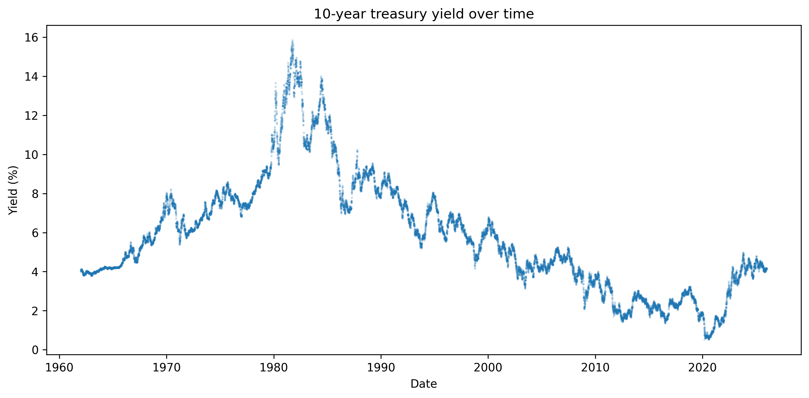

# parse-test

Small practice project for pulling a FRED series, validating the response, shaping it into a tidy DataFrame, and handing it off to plotting or cache consumers.

## What it does
- Fetches a FRED series (e.g., DGS10) with explicit request params and status checks.
- Parses `observations` into `{date: datetime.date, value: float}` rows while dropping null or invalid points.
- Builds a sorted pandas DataFrame as the contract for downstream use.
- Caches the cleaned DataFrame plus metadata to `cache/` with TTL checks and safe writes.
- Provides a simple matplotlib scatter plot of the cached/fetched data and saves it to `images/dgs10_yield.png`.

## Data flow
FRED API → raw JSON → validated observations → cleaned rows → pandas DataFrame → (cache | plot)

## Project layout
- `fred_data_call.py`: fetch/validate/parse plus cache read/write helpers and a main-guard demo.
- `plot.py`: imports `get_fred_series_df` and plots the series without refetching when cache is fresh.
- `.env`: holds `API_KEY` (git-ignored).

## Setup and run
1) `pip3 install requests pandas python-dotenv matplotlib`
2) Create `.env` with `API_KEY=your_fred_api_key_here`
3) Build or refresh data: `python3 fred_data_call.py` (writes `cache/fred_<series>.csv` and metadata)
4) Plot the default series: `python3 plot.py` (uses cache when valid, otherwise fetches; saves chart to `images/dgs10_yield.png`)

## Unit testing
- Install test deps (alongside project deps): `pip3 install pytest requests pandas python-dotenv matplotlib`
- Run the suite: `pytest -q`
- Tests mock the FRED API and use temp dirs, so they do not hit the network or touch the real cache/images directories.

## Caching notes
- Cache TTL defaults to 24h; stale cache is used if the API fails but files validate.
- Cache writes are atomic and refuse empty/invalid DataFrames.
- Metadata tracks series id, pull time, row count, and max observation date.

## Plot preview

## Next steps
- Explore other FRED series IDs and compare plots.
- Add CLI flags for TTL, series id, and cache dir.
- Layer in lightweight tests for parsing and cache invariants.
- Try different plot types (lines, rolling averages) to deepen matplotlib skills.
- Integrate a notebook or dashboard to keep learning pandas and visualization.
